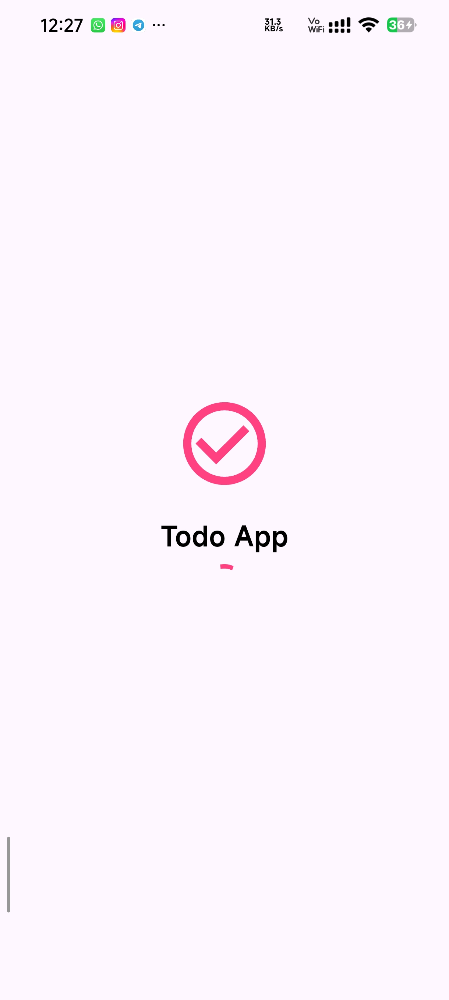
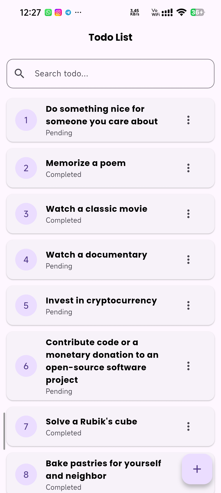
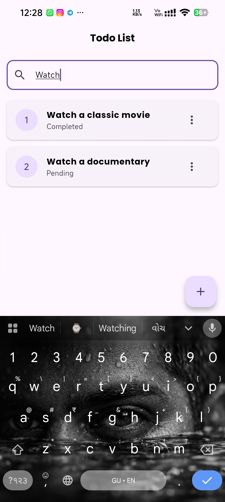
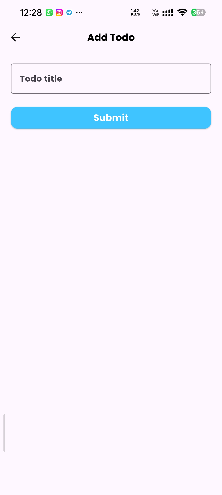
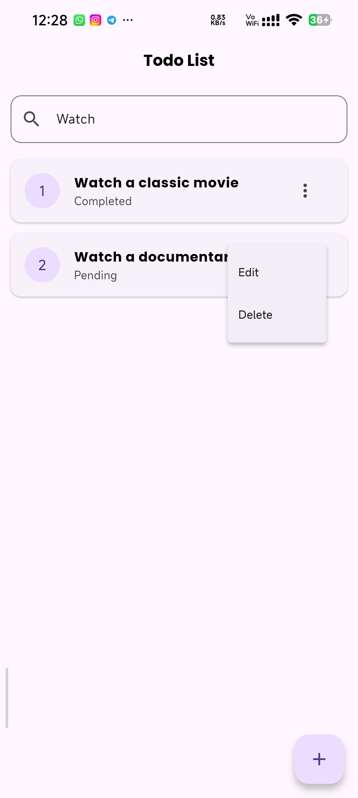
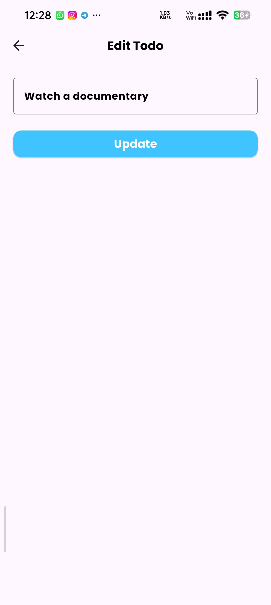

# 📝 Flutter Todo Pro

[](https://flutter.dev)
[](https://dart.dev)
[](https://dummyjson.com)
[](LICENSE)

A modern, high-performance **Todo Application** built with Flutter.  
This project demonstrates seamless **REST API integration**, reactive UI updates, and a polished *
*Material Design** aesthetic.

---

## ✨ Features

- 🚀 **Splash Screen** – Professional entry animation and branding
- 🌐 **REST API Integration** – Full CRUD operations using `dummyjson.com`
- 🔍 **Smart Search** – Real-time filtering with a fixed search bar
- 🔄 **Pull to Refresh** – Instantly sync data with a swipe
- ✏️ **Edit & Delete** – Complete task lifecycle management
- 🎨 **Google Fonts** – Clean typography using Poppins
- 📱 **Responsive UI** – Optimized for all screen sizes

---

## 📸 App Screenshots

### 🔹 UI Gallery

|                Home Screen                |                Search Todo                |                 Add Todo                  |
|:-----------------------------------------:|:-----------------------------------------:|:-----------------------------------------:|
|  |  |  |

|                 Edit Todo                 |                Delete Todo                |               Splash Screen               |
|:-----------------------------------------:|:-----------------------------------------:|:-----------------------------------------:|
|  |  |  |

---

## 🛠 Tech Stack

- **Framework:** Flutter
- **Language:** Dart
- **Networking:** HTTP package
- **Fonts:** Google Fonts
- **Mock Backend:** DummyJSON REST API

---

## 📂 Project Structure

```text
lib/
├── main.dart           # App entry point & theme setup
├── splash_screen.dart  # Splash screen & navigation
├── todo_list.dart      # Main UI, search & API logic
└── add_page.dart       # Add/Edit Todo screens


🚀 Getting Started
Prerequisites

Flutter SDK installed

Android Studio or VS Code

Emulator or physical device

Installation
git clone https://github.com/mahekjkevat/flutter-todo-app.git
cd flutter-todo-app
flutter pub get
flutter run
⚠️ Important Note

This project uses a mock REST API (dummyjson.com).

Data is not persistent

Added/edited/deleted todos reset on refresh

Intended for learning & demonstration purposes

👨‍💻 Author

Mahek K.
Flutter Developer


⭐ Support

If you like this project, please consider giving it a ⭐ on GitHub!

💡 GitHub Pro Tips

Add tags in About: flutter, dart, rest-api, todo-app

Pin this repository on your GitHub profile

Add screenshots for better recruiter visibility


---


## ✅ OPTIONAL (Highly Recommended)


### 1️⃣ Add a LICENSE file (MIT)


Create a file named `LICENSE` and paste MIT license text.  
If you want, I’ll generate it instantly.


### 2️⃣ Commit README Update


```powershell
git add README.md
git commit -m "Improve README with screenshots and professional formatting"
git push